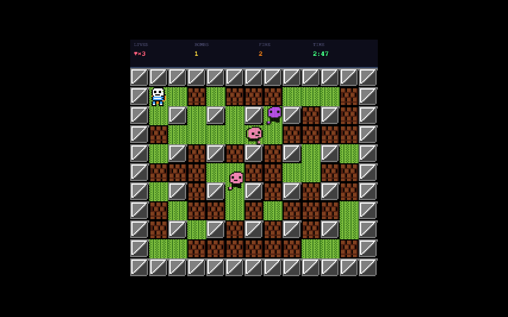

# Blast Grid

**A grid-based arcade game built from scratch in vanilla JavaScript and HTML5 Canvas — no frameworks, no build step. Place bombs, blow up soft walls, dodge wandering enemies, find the hidden exit door.**

This exists to exercise game-engine fundamentals cleanly: a 60 FPS main loop, a shared entity-update contract, grid collision, bomb propagation, and reactive enemy AI — all separated into small modules with no framework dependencies.



## What works

- Player movement, bomb placement, fuse + cross-pattern detonation
- Three wandering enemies with wall and bomb avoidance
- Power-ups (extra bomb, extra fire range, speed)
- Soft-wall destruction and hidden exit door
- Seeded procedural layout for Stage 1-1 (classic even-cell hard-wall checkerboard)
- HUD (lives, score, countdown timer)
- Title → playing → stage-clear / game-over state machine

## What's missing

Honest: the engine is there, the content isn't. Only Stage 1-1 is implemented, audio modules are stubbed but not wired to any `.wav` files, and only one enemy type is implemented. No screen shake, particles, or high-score persistence.

## Architecture

~2,600 lines across 13 modules, each doing one thing:

| Module | Role |
|---|---|
| [`js/main.js`](js/main.js) | Bootstrap: canvas, DOM ready, `requestAnimationFrame` loop |
| [`js/game.js`](js/game.js) | Core state machine, main loop, entity dispatch |
| [`js/player.js`](js/player.js) | Movement, bomb placement, power-up tracking, death |
| [`js/bomb.js`](js/bomb.js) | Bomb fuse + cross-pattern explosion raycast |
| [`js/enemy.js`](js/enemy.js) | Wandering enemy AI with collision avoidance |
| [`js/powerup.js`](js/powerup.js) | Power-up pick-ups + exit door reveal + level factory |
| [`js/level.js`](js/level.js) | Seeded procedural layout (mulberry32 PRNG) |
| [`js/renderer.js`](js/renderer.js) | Z-ordered Canvas drawing pipeline (7 layers) |
| [`js/sprites.js`](js/sprites.js) | Sprite sheet cache + animation frames |
| [`js/input.js`](js/input.js) | Arrow keys + space polling |
| [`js/hud.js`](js/hud.js) | Top-bar lives / score / timer |
| [`js/sounds.js`](js/sounds.js) | Web Audio wrapper with graceful fallback |
| [`js/config.js`](js/config.js) | Grid, tile size, timers, colour palette |

Every entity follows the same contract: `update(dt, game)` mutates state, `draw(ctx)` renders, `bbox()` returns a collision rect.

## Key decisions

- **Raycast bomb chain.** Explosions propagate via a 4-direction raycast from the bomb tile — stop at hard walls or grid boundary, destroy soft walls on contact, damage anything in the path. Makes explosion chaining emerge from the same primitive rather than a special case.
- **Reactive enemy AI, not pathfinding.** Enemies pick a random legal direction each frame (wall + bomb aware), avoiding reversal unless forced. Cheap, looks right, no A\*.
- **Seeded layout.** `mulberry32(12345)` + the classic even-cell hard-wall checkerboard + 60 / 40 soft-wall fill, with (1,1), (1,2), (2,1) forced empty for the spawn corner. Deterministic and reproducible for testing.

## Running it

```bash
open index.html
# or
python3 -m http.server 8000 && open http://localhost:8000
```

Enter to start, arrow keys to move, space to place a bomb. Blow up soft walls to reveal the exit door.

## Where to start reading

1. [`js/game.js`](js/game.js) — main loop, entity dispatch, state transitions
2. [`js/bomb.js`](js/bomb.js) — clearest example of the raycast-propagation pattern
3. [`js/enemy.js`](js/enemy.js) — reactive AI with smooth pixel movement on a grid
4. [`js/player.js`](js/player.js) — corridor snapping and power-up effects
